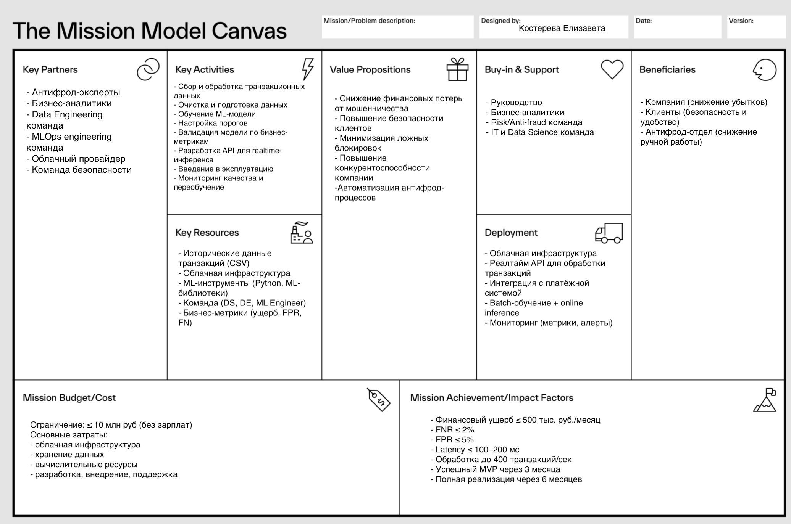

# Антифрод-система

## 1. Цели антифрод-системы

- Снизить финансовый ущерб от мошенничества до уровня ≤ 500 тыс. руб./мес
- Снизить долю пропущенных мошеннических транзакций (False Negative Rate) ≤ 2% от общего числа
- Сохранить клиентскую базу → доля ложных отклонений (False Positive Rate) ≤ 5%
- Обрабатывать до 400 транзакций/сек
- Работать в облачной инфраструктуре
- Обеспечить безопасность данных (шифрование, контроль доступа, хранение по 153ФЗ)
- Время ответа ≤ 100–200 мс
- Обработка транзакций в режиме реального времени

## 2. Выбор метрики машинного обучения

В задаче выявления мошеннических транзакций использование стандартных метрик классификации является недостаточным.

### Почему accuracy не подходит

- Классы сильно несбалансированы (доля мошеннических транзакций крайне мала)
- Модель может показывать высокую accuracy, игнорируя редкий класс мошенничества
- Ошибки имеют разную стоимость (ложные пропуски и ложные срабатывания приводят к различным последствиям)

### Почему Recall и Precision по отдельности не подходят

- Максимизация Recall приводит к росту числа ложных срабатываний (FPR), что ухудшает пользовательский опыт и может вызвать отток клиентов
- Максимизация Precision снижает количество ложных блокировок, но увеличивает число пропущенных мошеннических операций, что ведёт к финансовым потерям

### Почему F1-score не подходит

- Не учитывает различную стоимость ошибок
- Предполагает равную важность FP и FN, что не соответствует бизнес-контексту задачи

### Выбор метрики

В качестве основной метрики используется функция ожидаемых финансовых потерь:

```
Loss = FN × Cost_FN + FP × Cost_FP
```

Данная метрика выбрана, поскольку она напрямую отражает бизнес-цель проекта — минимизацию финансового ущерба от мошенничества.

### Ограничения на качество модели

Оптимизация проводится при следующих ограничениях:

- Доля пропущенных мошеннических транзакций ≤ 2%
- Доля ложных срабатываний (FPR) ≤ 5%

Данные ограничения обусловлены:

- Необходимостью минимизации финансовых потерь (ограничение на FN)
- Необходимостью сохранения клиентской базы (ограничение на FP)

## 3. MISSION Canvas

Были проанализированы особенности проекта с использованием MISSION Canva:

