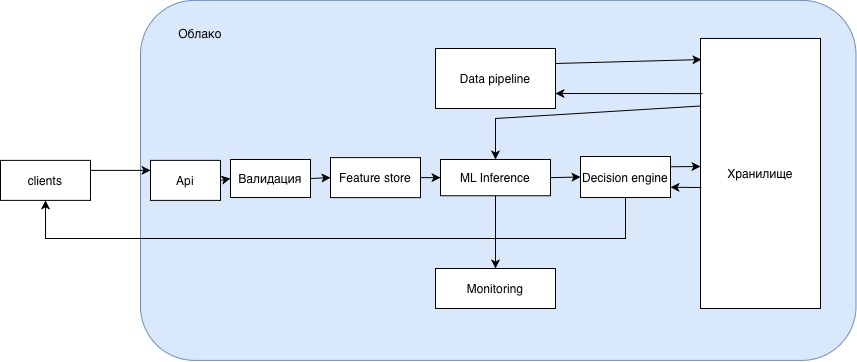
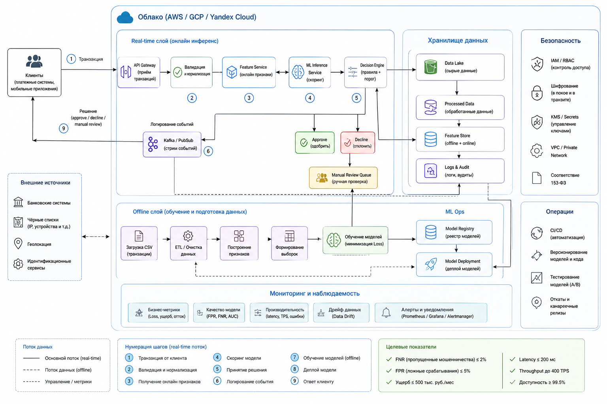

# Антифрод-система

## 1. Цели антифрод-системы

- Снизить финансовый ущерб от мошенничества до уровня ≤ 500 тыс. руб./мес
- Снизить долю пропущенных мошеннических транзакций (False Negative Rate) ≤ 2% от общего числа
- Сохранить клиентскую базу → доля ложных отклонений (False Positive Rate) ≤ 5%
- Обрабатывать до 400 транзакций/сек
- Работать в облачной инфраструктуре
- Обеспечить безопасность данных (шифрование, контроль доступа, хранение по 153ФЗ)
- Время ответа ≤ 100–200 мс
- Обработка транзакций в режиме реального времени

## 2. Выбор метрики машинного обучения

В задаче выявления мошеннических транзакций использование стандартных метрик классификации является недостаточным.

### Почему accuracy не подходит

- Классы сильно несбалансированы (доля мошеннических транзакций крайне мала)
- Модель может показывать высокую accuracy, игнорируя редкий класс мошенничества
- Ошибки имеют разную стоимость (ложные пропуски и ложные срабатывания приводят к различным последствиям)

### Почему Recall и Precision по отдельности не подходят

- Максимизация Recall приводит к росту числа ложных срабатываний (FPR), что ухудшает пользовательский опыт и может вызвать отток клиентов
- Максимизация Precision снижает количество ложных блокировок, но увеличивает число пропущенных мошеннических операций, что ведёт к финансовым потерям

### Почему F1-score не подходит

- Не учитывает различную стоимость ошибок
- Предполагает равную важность FP и FN, что не соответствует бизнес-контексту задачи

### Выбор метрики

В качестве основной метрики используется функция ожидаемых финансовых потерь:

```
Loss = FN × Cost_FN + FP × Cost_FP
```

Данная метрика выбрана, поскольку она напрямую отражает бизнес-цель проекта — минимизацию финансового ущерба от мошенничества.

### Ограничения на качество модели

Оптимизация проводится при следующих ограничениях:

- Доля пропущенных мошеннических транзакций ≤ 2%
- Доля ложных срабатываний (FPR) ≤ 5%

Данные ограничения обусловлены:

- Необходимостью минимизации финансовых потерь (ограничение на FN)
- Необходимостью сохранения клиентской базы (ограничение на FP)

## 3. MISSION Canvas

Были проанализированы особенности проекта с использованием MISSION Canva:


---

## 4. Декомпозиция

### Общая структура

Система антифрода развернута в облачной инфраструктуре и состоит из следующих основных компонентов:

- API-сервер (приём транзакций)
- Модуль валидации данных
- Feature Store (хранилище признаков)
- ML Inference сервис (скоринг транзакций)
- Decision Engine (принятие решений)
- Data Pipeline (обработка и подготовка данных)
- Хранилище данных
- Система мониторинга

Система обрабатывает транзакции в режиме реального времени и обеспечивает принятие решения с задержкой не более 100–200 мс.

### Поток обработки транзакции (online)

Обработка транзакции происходит следующим образом:

1. Клиент (clients) отправляет транзакцию в систему
2. Запрос поступает в API-сервер, который является точкой входа
3. Далее транзакция проходит этап валидации:
   - проверка формата данных
   - нормализация значений
   - базовые бизнес-проверки
4. После этого система обращается к Feature Store:
   - извлекаются заранее подготовленные признаки
   - могут рассчитываться онлайн-признаки (например, частота транзакций)
5. Подготовленные данные передаются в ML Inference сервис:
   - модель оценивает вероятность мошенничества
   - на выходе — числовой скор (probability score)
6. Результат поступает в Decision Engine:
   - применяется порог (threshold)
   - учитываются бизнес-правила
   - формируется итоговое решение:
     - одобрить (approve)
     - отклонить (decline)
     - ручная проверка (manual review)
7. Результат возвращается клиенту через API

### Работа с данными (offline pipeline)

Data Pipeline отвечает за обработку исторических данных и обучение модели:

- Загружаются CSV-файлы с транзакциями
- Выполняется очистка и предобработка данных
- Формируются признаки (feature engineering)
- Обновляются данные в хранилище
- Подготавливаются данные для обучения модели

### Хранилище данных

Хранилище используется как центральный компонент для работы с данными и включает:

- исторические транзакции
- подготовленные данные
- признаки (features)
- результаты скоринга
- логи системы

### ML-модуль

ML Inference сервис выполняет:

- применение обученной модели
- вычисление вероятности мошенничества
- передачу результата в Decision Engine

Модель обучается оффлайн через Data Pipeline и затем используется в режиме реального времени.

### Decision Engine

Decision Engine реализует бизнес-логику:

- применение пороговых значений
- балансировка между:
  - False Positive (ложные срабатывания)
  - False Negative (пропущенные мошенничества)
- финальное решение по транзакции

### Мониторинг

Система мониторинга отслеживает:

- работу ML-модуля
- качество модели
- поведение системы

Собираемые метрики:

- Loss
- FPR (False Positive Rate)
- FNR (False Negative Rate)
- производительность (latency)
- системные показатели

### Облачная инфраструктура

Все компоненты системы размещены в облаке, что обеспечивает:

- масштабируемость (до 400 транзакций/сек)
- отказоустойчивость
- гибкость развертывания
- выполнение требований по инфраструктуре

### Диаграмма взаимодействия компонентов

Была составлена диаграмма взаимодействия компонентов системы (как я это вижу):



### Альтернативное представление архитектуры

Представление архитектуры на основе описания (как видит GPT):



---

## 5. Задачи S.M.A.R.T.

### 1. Сбор и подготовка данных (2 недели)

Собрать все CSV-файлы с транзакциями в единый датасет (не меньше 1 млн записей) и привести их к удобному для анализа виду. Это будет основа для всей дальнейшей работы.

### 2. Первичный анализ данных (EDA) (2 недели)

Разобраться в данных:

- проверить, есть ли дисбаланс между мошенническими и обычными операциями
- понять, какие признаки действительно важны
- визуализировать основные закономерности и аномалии

### 3. Базовая модель антифрода (3 недели)

Обучить первую модель, чтобы получить отправную точку по качеству.

Целевые ориентиры:

- пропуск мошенничества (FNR) — не выше 5%
- ложные срабатывания (FPR) — не выше 10% (на старте допустимо больше)

### 4. API для оценки транзакций в реальном времени (4 недели)

Сделать сервис, который будет проверять транзакции «на лету».

Требования:

- задержка ответа — до 200 мс
- обработка — не менее 400 транзакций в секунду

### 5. Мониторинг системы (2 недели)

Настроить наблюдение за системой:

- логирование
- отслеживание ошибок модели (FP/FN)
- алерты при отклонениях

### 6. Автоматизация обработки данных (pipeline) (3 недели)

Настроить процесс, который сам загружает и обрабатывает новые транзакции.

Требования:

- минимум 1 млн транзакций в час
- никаких потерь данных


### 7. Оптимизация модели под бизнес (5 недель)

Улучшить модель с учётом реальных потерь бизнеса:

- снизить FNR до ≤ 2%
- снизить FPR до ≤ 5%
- уменьшить общий Loss минимум на 30% относительно базовой модели

Методы: подбор параметров (grid search / Bayesian optimization), настройка порога

### 8. Развертывание в облаке с безопасностью (4 недели)

Развернуть систему в облаке и обеспечить защиту данных:

- шифрование
- разграничение доступа (RBAC)
- доступность сервиса не ниже 99.9%

Платформы: Yandex Cloud

---

## 6. GitHub-репозиторий и проект

- GitHub-репозиторий: https://github.com/lizkakostereva-lgtm/otus-project
- GitHub Project доска с задачами: https://github.com/users/lizkakostereva-lgtm/projects/1/

