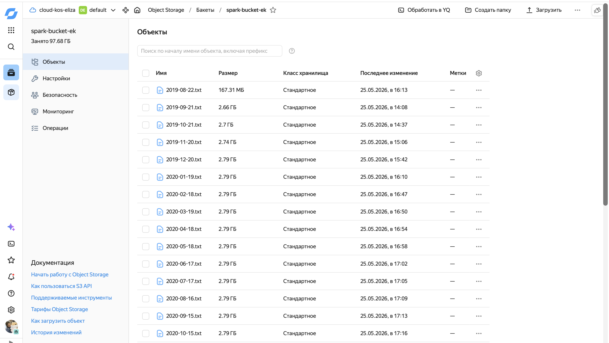
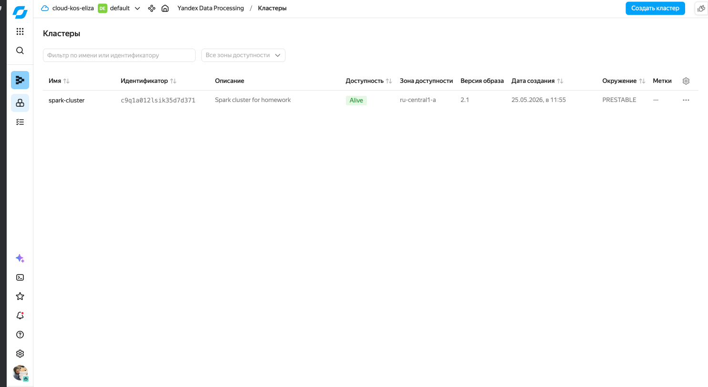
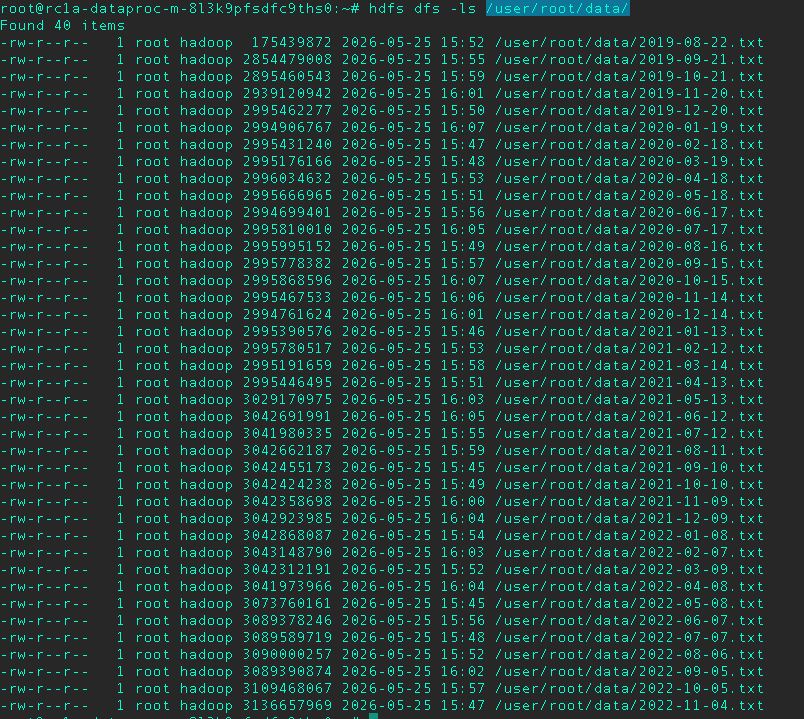

# Yandex Data Processing Project

## Обзор проекта

Проект разворачивает инфраструктуру для обработки данных с использованием Yandex Cloud:

- **S3-совместимое хранилище (Object Storage)** — для хранения исходных данных
- **Yandex Data Processing** — Spark-кластер для обработки данных
- **HDFS** — распределённая файловая система Hadoop

## Структура проекта

```
yc-yandex-data-processing/
├── terraform/           # Terraform манифесты для создания инфраструктуры
├── scripts/             # Скрипты для работы с данными
├── screenshots/         # Скриншоты для проверки
├── .gitignore          # Файлы, исключённые из Git
└── README.md           # Этот файл
```

---

## Terraform манифесты

### 1. versions.tf — Версии Terraform и провайдеров

```hcl
terraform {
  required_version = ">= 1.5.0"

  required_providers {
    yandex = {
      source  = "yandex-cloud/yandex"
      version = "~> 0.140"
    }
  }
}
```

**Что делает:**
- Указывает минимальную версию Terraform (1.5.0)
- Подключает провайдер Yandex Cloud версии 0.140
- Провайдер — это плагин, который позволяет Terraform управлять ресурсами облачного провайдера

**Зачем нужно:** Без провайдера Terraform не знает, как создавать ресурсы в Yandex Cloud.

---

### 2. providers.tf — Настройка провайдера

```hcl
provider "yandex" {
  tokent                   = var.token
  cloud_id                 = var.cloud_id
  folder_id                = var.folder_id
  zone                     = var.zone
}
```

**Что делает:**
- Настраивает подключение к Yandex Cloud
- `token` — iam token
- `cloud_id` — идентификатор облака
- `folder_id` — идентификатор каталога, где будут создаваться ресурсы
- `zone` — зона доступности (по умолчанию ru-central1-a)

**Переменные берутся из:** `variables.tf`

---

### 3. variables.tf — Переменные

```hcl
variable "cloud_id" {}           # ID облака
variable "folder_id" {}         # ID каталога
variable "zone" { default = "ru-central1-a" }  # Зона
variable "token" {}        # iam token
variable "bucket_name" { default = "netology-spark-bucket" }
variable "service_account_id" {} # ID сервисного аккаунта
variable "cluster_name" { default = "spark-cluster" }
```

**Что делает:**
- Определяет параметры, которые нужно указать при запуске Terraform
- Значения по умолчанию указаны для необязательных переменных
- Обязательные переменные (без default): cloud_id, folder_id, token, service_account_id

**Зачем нужно:** Позволяет использовать одни и те же манифесты с разными параметрами.

---

### 4. main.tf — Основные ресурсы

Этот файл создаёт два ресурса:

#### 4.1. S3 Bucket (yandex_storage_bucket)

```hcl
resource "yandex_storage_bucket" "spark_bucket" {
  bucket = var.bucket_name

  anonymous_access_flags {
    read = true
    list = true
  }

  force_destroy = true
}
```

| Параметр | Значение | Описание |
|----------|----------|----------|
| bucket | netology-spark-bucket | Имя бакета |
| anonymous_access_flags.read | true | Разрешить чтение файлов без аутентификации |
| anonymous_access_flags.list | true | Разрешить просмотр списка файлов |
| force_destroy | true | Удалить бакет при destroy (даже если есть файлы) |

**Что создаёт:** Бакет в Object Storage для хранения данных.

---

#### 4.2. Spark-кластер (yandex_dataproc_cluster)

```hcl
resource "yandex_dataproc_cluster" "spark_cluster" {
  name        = var.cluster_name
  description = "Spark cluster for homework"
  bucket      = yandex_storage_bucket.spark_bucket.bucket
  service_account_id = var.service_account_id
  zone_id     = var.zone
  security_group_ids = var.security_group_ids

  cluster_config {
    version_id = "2.1"

    hadoop {
      services = ["SPARK", "HDFS", "YARN"]
      properties = {
      }
      ssh_public_keys = [var.ssh_public_key]
      oslogin = false
    }

    subcluster_spec {
      name = "master"
      role = "MASTERNODE"
      assign_public_ip = true
      resources {
        resource_preset_id = "s3-c2-m8"
        disk_type_id       = "network-hdd"
        disk_size          = 40
      }
      hosts_count = 1
    }

    subcluster_spec {
      name = "data"
      role = "DATANODE"
      resources {
        resource_preset_id = "s3-c4-m16"
        disk_type_id       = "network-hdd"
        disk_size          = 128
      }
      hosts_count = 3
    }
  }
}
```

**Подкластер MASTER:**
| Параметр | Значение |
|----------|----------|
| role | MASTERNODE |
| resource_preset_id | s3-c2-m8 (2 ядра, 8 ГБ RAM) |
| disk_type_id | network-hdd |
| disk_size | 40 ГБ |
| hosts_count | 1 |

Мастер-узел управляет кластером и координирует работу.

**Подкластер DATA:**
| Параметр | Значение |
|----------|----------|
| role | DATANODE |
| resource_preset_id | s3-c4-m16 (4 ядра, 16 ГБ RAM) |
| disk_type_id | network-hdd |
| disk_size | 128 ГБ |
| hosts_count | 3 |

Data-узлы хранят данные и выполняют вычисления.

**Сервисы:**
- **SPARK** — движок для распределённой обработки данных
- **HDFS** — распределённая файловая система Hadoop
- **YARN** — менеджер ресурсов кластера

---

### 5. outputs.tf — Вывод информации

```hcl
output "bucket_url" {
  value = "https://storage.yandexcloud.net/${yandex_storage_bucket.spark_bucket.bucket}"
}

output "cluster_name" {
  value = yandex_dataproc_cluster.spark_cluster.name
}

output "master_host" {
  value = yandex_dataproc_cluster.spark_cluster.host_fqdn[0]
}
```

**Что делает:**
- После создания ресурсов выводит полезную информацию
- `bucket_url` — ссылка на бакет
- `cluster_name` — имя кластера
- `master_host` — FQDN мастер-узла для подключения по SSH

---

### 6. terraform.tfvars.example — Пример переменных

```hcl
cloud_id            = "xxxxxxxx"
folder_id           = "xxxxxxxx"
service_account_id  = "xxxxxxxx"
token               = "token"
bucket_name         = "spark-bucket-ek"
cluster_name        = "spark-cluster"
zone                = "ru-central1-a"
```

**Как использовать:**
1. Скопировать в `terraform.tfvars`
2. Заполнить реальными значениями

---

## Скрипты

### s3_upload.sh — Загрузка данных в S3

**Что делает:** Копирует данные из исходного хранилища в ваш бакет.

**Требования:** Настроенный s3cmd с доступом к Object Storage.

---


### distcp_to_hdfs.sh — Копирование данных в HDFS

**Что делает:**
1. Копирует данные из S3 в HDFS с помощью hadoop distcp
2. Выводит содержимое директории /data в HDFS


---

## Порядок развёртывания

### Шаг 1: Подготовка переменных

```bash
cd terraform
cp terraform.tfvars.example terraform.tfvars
# Отредактировать terraform.tfvars, заполнив реальные значения
```

### Шаг 2: Инициализация Terraform

```bash
terraform init
```

Загружает провайдер Yandex Cloud.

### Шаг 3: Проверка плана

```bash
terraform plan
```

Покажет, какие ресурсы будут созданы.

### Шаг 4: Создание ресурсов

```bash
terraform apply
```

Создаёт бакет и Spark-кластер. После выполнения выведет:
- bucket_url
- cluster_name
- master_host

### Шаг 5: Загрузка данных

```bash
# Настроить s3cmd
s3cmd --configure

# Скопировать данные
bash ../scripts/s3_upload.sh
```

### Шаг 6: Подключение и копирование в HDFS

```bash
# Подключиться к мастер-узлу

# Внутри SSH выполнить
bash scripts/distcp_to_hdfs.sh
```

### Шаг 7: Удаление ресурсов

```bash
terraform destroy
```

Удаляет все созданные ресурсы.

---

## Ссылки

- **Bucket URL:** https://storage.yandexcloud.net/spark-bucket-ek

---

## Скриншоты для проверки

1. **Bucket** — скриншот публичного бакета в консоли

2. **Dataproc Cluster** — работающий кластер в консоли

3. **HDFS** — вывод `/user/root/data/` с файлами
