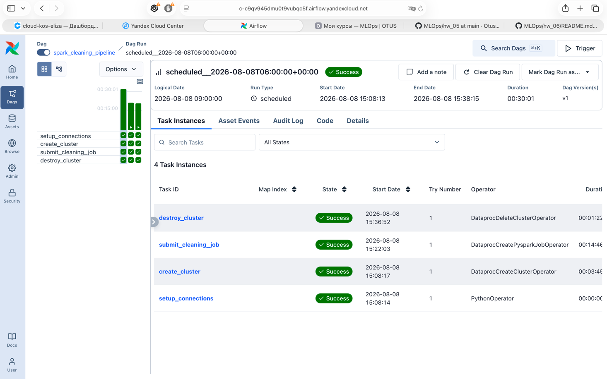

# Домашнее задание — Airflow DAG для очистки датасета

Ежедневный пайплайн: создание Spark-кластера (Yandex Data Proc) → очистка датасета через PySpark → удаление кластера. Airflow запущен в **Yandex Cloud Managed Service for Apache Airflow**, инфраструктура разворачивается **Terraform**.

---

## Архитектура

```
GitHub Repo (hw_05)
  ├── airflow/dags/spark_cleaning_dag.py    — DAG Airflow
  ├── airflow/scripts/fraud_cleaning.py     — PySpark job (S3 → clean → Parquet → S3)
  └── .github/workflows/deploy-dags.yml     — CI/CD: DAG+скрипты в S3
        ↓ sync (aws s3 sync / GitHub Actions)
S3 (airflow-dags-bucket-ek)
  └── spark_cleaning_dag.py                 — читает Managed Airflow (code_sync)
S3 (spark-bucket-ek/scripts/)
  └── fraud_cleaning.py                     — читает Data Proc при spark-submit
        ↓ DataprocCreatePysparkJobOperator (main_python_file_uri = s3a://...)
Data Proc Cluster (создаётся и удаляется DAG'ом при каждом запуске)
  └── PySpark job: s3a://otus-mlops-source-data/*.txt → fraud_clean_parquet
```

## Схема DAG `spark_cleaning_pipeline`

```
setup_connections → create_cluster → submit_cleaning_job → destroy_cluster
                                                                ↑ trigger_rule=ALL_DONE
```

Операторы `airflow.providers.yandex`:
- `DataprocCreateClusterOperator` — создание кластера;
- `DataprocCreatePysparkJobOperator` — запуск PySpark. При старте задания Yandex Data Proc
  сам копирует скрипт `fraud_cleaning.py` из S3 на кластер (`main_python_file_uri`) и запускает
  его через `spark-submit` — это и есть этап «копирования скрипта на кластер»;
- `DataprocDeleteClusterOperator` — удаление кластера (ID берётся из XCom `cluster_id`).

Расписание: `0 6 * * *` (ежедневно в 06:00).

---

## Предварительные требования

1. **Yandex Cloud** аккаунт с активным биллингом и правами владельца/редактора в каталоге.
2. **Yandex Cloud CLI** (`yc`) — установка и вход: `yc init`.
3. **Terraform** ≥ 1.5.
4. **AWS CLI** для загрузки DAG/скриптов в Object Storage (или GitHub Actions).
5. Существующие **сеть VPC** и **подсеть** в каталоге (например, дефолтные `default` / `default-ru-central1-a`).

---

## Шаг 1. Конфигурация Terraform

```bash
cp terraform/terraform.tfvars.example terraform/terraform.tfvars
```

Заполнить в `terraform/terraform.tfvars`:

| Переменная | Описание |
|---|---|
| `cloud_id`, `folder_id` | ID облака и каталога (`yc config list`) |
| `network_id`, `subnet_id` | ID сети и подсети (`yc vpc network list`, `yc vpc subnet list`) |
| `token` | OAuth-токен или ключ SA с правами на каталог |
| `ssh_public_key` | Публичный SSH-ключ (для нод Data Proc) |
| `airflow_admin_password` | Пароль админа Airflow — **мин. 8 символов, обязательно буквы + цифры** (иначе `terraform apply` упадёт с `admin password validation failure: password does not have digits`) |

## Шаг 2. Развёртывание инфраструктуры

```bash
cd terraform
terraform init
terraform apply
```

**Что создаст Terraform:**

| Ресурс | Имя | Назначение |
|---|---|---|
| `dataproc-sa` | Service Account | Для нод Data Proc кластера (создаётся DAG'ом) |
| `airflow-sa` | Service Account | Для Managed Airflow + управления Data Proc |
| `spark-bucket-ek` | S3 Bucket | Скрипты Spark и результаты очистки |
| `airflow-dags-bucket-ek` | S3 Bucket | DAG'и Airflow |
| `spark-sg` | Security Group | Для Data Proc |
| `spark-nat` / route table | NAT Gateway | Доступ нод и Airflow в интернет |
| `airflow-cluster` | Managed Airflow | Сервис Airflow |

> Постоянный Spark-кластер Terraform **не создаёт** — кластер создаётся и удаляется DAG'ом
> при каждом запуске (экономия ресурсов по условию ДЗ).

> Кластер Airflow создаётся с **Apache Airflow 3.1** (Python 3.12). Для версии 3.x обязателен
> блок `dag_processor` (DAG-процессор вынесен в отдельный компонент) — он уже настроен в `airflow.tf`.

### Важно: подключить NAT к подсети

Managed Airflow и Data Proc работают в приватной подсети — им нужен выход в интернет.
После apply привязать route table к подсети (один раз):

```bash
yc vpc subnet update <subnet-id> \
  --route-table-id $(terraform output -raw nat_rt_id)
```

Проверка: `yc vpc subnet get <subnet-id>` — должен появиться `route_table_id`.

---

## Шаг 3. Загрузка DAG и скриптов в S3

Нужны статические ключи сервисного аккаунта с доступом к Object Storage
(например, `dataproc-sa`):

```bash
yc iam access-key create --service-account-name dataproc-sa \
  --description "airflow-deploy"
# в выводе: key_id = AWS_ACCESS_KEY_ID, secret = AWS_SECRET_ACCESS_KEY
```

```bash
export AWS_ACCESS_KEY_ID=<key_id>
export AWS_SECRET_ACCESS_KEY=<secret>
export AWS_ENDPOINT_URL=https://storage.yandexcloud.net

# DAG — в корень бакета Airflow
aws s3 sync airflow/dags/ s3://airflow-dags-bucket-ek/ --delete --exclude "*" --include "*.py"

# PySpark скрипт — в бакет Data Proc
aws s3 sync airflow/scripts/ s3://spark-bucket-ek/scripts/ --delete
```

Либо пушить в `main` — это сделает GitHub Actions (см. ниже), если заданы secrets.

---

## Шаг 4. Переменные в Airflow

В веб-интерфейсе Managed Airflow: **Admin → Variables**.

| Variable | Описание | Как получить |
|---|---|---|
| `YC_FOLDER_ID` | ID каталога | `yc config list` |
| `YC_ZONE` | Зона (по умолч. `ru-central1-a`) | — |
| `YC_SUBNET_ID` | ID подсети | `yc vpc subnet list` |
| `YC_S3_BUCKET` | Бакет Data Proc (по умолч. `spark-bucket-ek`) | — |
| `YC_SSH_PUBLIC_KEY` | Публичный SSH-ключ | тот же, что в tfvars |
| `DP_SA_ID` | ID `dataproc-sa` | `terraform output service_account_id` |
| `DP_SECURITY_GROUP_ID` | ID security group | `terraform output security_group_id` |
| `DP_SA_JSON` | Authorized key JSON `airflow-sa` | см. ниже |
| `YC_INPUT_S3` (опц.) | Путь к сырым данным | `s3a://otus-mlops-source-data/*.txt` |
| `YC_OUTPUT_S3` (опц.) | Куда писать результат | `s3a://spark-bucket-ek/fraud_clean_parquet` |

**Формирование `DP_SA_JSON`** (authorized key сервисного аккаунта `airflow-sa`):

```bash
terraform output airflow_sa_auth_key_id
terraform output airflow_sa_auth_key_public
terraform output -raw airflow_sa_auth_key_private
```

Соберите JSON (поле `private_key` — многострочный ключ целиком):

```json
{
  "id": "<airflow_sa_auth_key_id>",
  "service_account_id": "<airflow_service_account_id>",
  "created_at": "2026-07-04T00:00:00Z",
  "public_key": "<airflow_sa_auth_key_public>",
  "private_key": "<airflow_sa_auth_key_private>"
}
```

Вставьте этот JSON в значение переменной `DP_SA_JSON`.

### Подключение `yc-dataproc`

В Airflow 3 прямой доступ к БД из DAG и задач запрещён, поэтому подключение
создаётся один раз вручную: **Admin → Connections → +**:

- Conn Id: `yc-dataproc`
- Conn Type: `yandexcloud`
- Extra (JSON) — экранированный вариант переменных:

```json
{
  "public_ssh_key": "<ваш SSH public key, как в YC_SSH_PUBLIC_KEY>",
  "service_account_json": "<вся строка DP_SA_JSON, с экранированием \\\" и \\n>"
}
```

> Проще всего сгенерировать Extra автоматически — в репозитории нет готового скрипта,
> но DAG читает ровно эти два поля, поэтому достаточно аккуратно экранировать строки.
> Само подключение нужно только один раз (в отличие от переменных).

---

## Шаг 5. Активация и проверка DAG

1. Откройте веб-интерфейс: `terraform output airflow_webui_url` (логин `admin`, пароль из tfvars).
2. **DAGs** → найдите `spark_cleaning_pipeline` (загружается из S3 в течение ~1–2 мин после шага 3).
3. Включите DAG (Toggle On).
4. Нажмите **Trigger DAG** для ручного теста.

Задача `setup_connections` проверит наличие всех обязательных переменных и
наличие подключения `yc-dataproc` не создаёт — оно должно быть создано заранее
(см. «Подключение yc-dataproc» выше). Если какой-то переменной нет — задача
упадёт с понятной ошибкой в логах.

### Дождаться 3+ успешных запусков 

Полный цикл (создание кластера → очистка → удаление) занимает 40–60 минут.

```python
schedule="0 * * * *",   # ежечасно для проверки
```

затем `aws s3 sync airflow/dags/ s3://airflow-dags-bucket-ek/ --delete --exclude "*" --include "*.py"`
и включить DAG. Через ~3–4 часа будут 3+ успешных запуска.

> Учёт успешных запусков ведётся по задаче `submit_cleaning_job` — это сам скрипт очистки.
> `destroy_cluster` имеет `trigger_rule=ALL_DONE` (удаляет кластер даже после ошибки).

## Снимок экрана



---

## CI/CD (GitHub Actions)

`.github/workflows/deploy-dags.yml` при пуше в `main/master` синхронизирует DAG и скрипты в S3.

Secrets/Variables репозитория:

| Type | Name | Описание |
|---|---|---|
| Secret | `YC_SA_ACCESS_KEY` | `key_id` статического ключа `dataproc-sa` |
| Secret | `YC_SA_SECRET_KEY` | `secret` статического ключа `dataproc-sa` |
| Variable | `YC_DAGS_BUCKET` | по умолч. `airflow-dags-bucket-ek` |
| Variable | `YC_SCRIPTS_BUCKET` | по умолч. `spark-bucket-ek` |

---

## Завершение работы (экономия ресурсов)

```bash
cd terraform
terraform destroy
# и отвязать route table (если подсеть остаётся):
yc vpc subnet update <subnet-id> --route-table-id ""
```

---

## Структура репозитория

```
hw_05/
├── airflow/
│   ├── dags/
│   │   └── spark_cleaning_dag.py      # DAG (Yandex providers)
│   └── scripts/
│       ├── fraud_cleaning.py          # PySpark job (S3 → S3)
│       └── distcp_to_hdfs.sh          # DistCp (reference, не используется)
├── terraform/
│   ├── airflow.tf                     # Managed Airflow + airflow-sa
│   ├── dataproc.tf                    # пояснения (кластер создаёт DAG)
│   ├── network.tf                     # NAT gateway, route table
│   ├── service_account.tf             # dataproc-sa + роли
│   ├── security_group.tf              # spark-sg
│   ├── bucket.tf                      # S3 бакеты
│   ├── providers.tf, versions.tf      # провайдер
│   └── variables.tf, outputs.tf       # переменные и outputs
├── .github/workflows/deploy-dags.yml  # CI/CD
├── img.png                            # скриншот Airflow UI (Grid)
└── README.md
```
